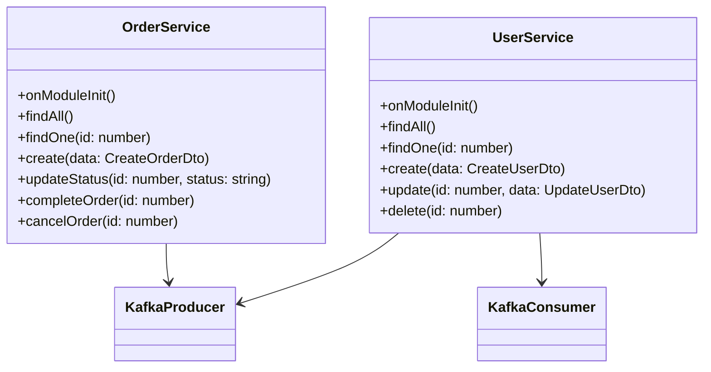

# Order Hub

## Project Overview

Order Hub is a NestJS-based application designed to manage and process orders efficiently. This project aims to provide a robust and scalable solution for order management, including features such as order creation, updating, deletion, and retrieval.

## Features

- **Order Management**: Create, update, and retrieve orders.
- **User Management**: Create, update, delete, and retrieve users.
- **Database Integration**: Seamless integration with a database for persistent storage.
- **API Documentation**: Comprehensive API documentation using Swagger.
- **Microservices Architecture**: Decoupled services for better scalability and maintainability.
- **Kafka Integration**: Efficient communication between services using Kafka.

## Tools Used

- **NestJS**: A progressive Node.js framework for building efficient and scalable server-side applications.
- **Prisma**: A next-generation ORM for Node.js and TypeScript.
- **Kafka**: A distributed event streaming platform capable of handling trillions of events a day.
- **Docker**: A platform for developing, shipping, and running applications in containers.
- **PostgreSQL**: An open-source relational database management system.
- **Swagger**: A tool for documenting and testing RESTful APIs.

## Prerequisites

Before you begin, ensure you have met the following requirements:

- Node.js (v14 or higher)
- npm (v6 or higher)
- PostgreSQL (v12 or higher)
- Prisma (v3 or higher)
- Docker (for containerized services)
- NestJS CLI (optional, but recommended)

### Installing PostgreSQL

1. **Windows**:
   - Download the PostgreSQL installer from the [official website](https://www.postgresql.org/download/windows/).
   - Run the installer and follow the instructions. Make sure to remember the username and password you set during the installation.
   - After installation, you can start the PostgreSQL service from the Start Menu or using the Services application.

2. **macOS**:
   - You can use Homebrew to install PostgreSQL. If you don't have Homebrew installed, follow the instructions on the [Homebrew website](https://brew.sh/).
   - Open a terminal and run:
     ```bash
     brew install postgresql
     ```
   - Start the PostgreSQL service:
     ```bash
     brew services start postgresql
     ```

3. **Linux**:
   - For Debian-based distributions (e.g., Ubuntu), run:
     ```bash
     sudo apt update
     sudo apt install postgresql postgresql-contrib
     ```
   - For Red Hat-based distributions (e.g., CentOS), run:
     ```bash
     sudo yum install postgresql-server postgresql-contrib
     sudo postgresql-setup initdb
     sudo systemctl start postgresql
     ```

### Installing Prisma

1. **Install Prisma CLI**:
   - Open a terminal and run:
     ```bash
     npm install -g prisma
     ```

2. **Initialize Prisma in your project**:
   - Navigate to your project directory and run:
     ```bash
     npx prisma init
     ```


## Installation

1. Clone the repository:
    ```bash
    git clone https://github.com/username/order-hub.git
    ```
2. Navigate to the project directory:
    ```bash
    cd order-hub
    ```

## Setup and Installation

1. **Install dependencies**:
   ```bash
   cd order-ms
   npm install
   cd ../user-ms
   npm install

2. **Set up Docker**:
   Make sure you have Docker installed and running. Then, start the services using Docker Compose:
   ```bash
   cd ../docker
   docker-compose up -d
   ```

3. **Run Prisma migrations**:
   ```bash
   cd ../order-ms
   npx prisma migrate dev
   cd ../user-ms
   npx prisma migrate dev
   ```

4. **Seed the databases**:
   ```bash
   cd ../order-ms
   npm run seed
   cd ../user-ms
   npm run seed
   ```

5. **Setup environment variables**:
   - Create a `.env` file in both order-ms and user-ms directories with the following content:
     ```bash
     DATABASE_URL="postgresql://<username>:<password>@localhost:5432/order_hub"
     ```

## Running the Services

1. **Start the Order Service**:
   ```bash
   cd order-ms
   npm run start:dev
   ```

2. **Start the User Service**:
   ```bash
   cd ../user-ms
   npm run start:dev
   ```

## Testing the Services

1. **Run unit tests**:
   ```bash
   cd order-ms
   npm run test
   cd ../user-ms
   npm run test
   ```

2. **Run end-to-end tests**:
   ```bash
   cd order-ms
   npm run test:e2e
   cd ../user-ms
   npm run test:e2e
   ```

## Kafka Communication

The Order Service and User Service communicate with each other using Kafka. Here is how the communication works:

1. **Order Service**:
   - When an order is created, the Order Service sends a message to the `order-events` topic with the event `ORDER_CREATED`.
   - When fetching all orders, the Order Service sends a message to the `order-events` topic with the event `GET_ALL_ORDERS`.

2. **User Service**:
   - The User Service subscribes to the `order-events` topic and listens for messages.
   - When it receives an `ORDER_CREATED` event, it processes the new order and logs the details to the console.
   - When it receives a `GET_ALL_ORDERS` event, it processes the list of orders and logs the details to the console.

You can observe the communication between the services by checking the console logs of the User Service.

## API Documentation

API documentation is available via Swagger. Once the application is running, you can access the documentation at

- Order Service: `http://localhost:3000/api`
- User Service: `http://localhost:3001/api`

## Class Diagram


## Conclusion

This project demonstrates how to build microservices using NestJS, Prisma, and Kafka. By following the steps outlined in this README, you can set up, run, and test the services, and observe the communication between them using Kafka.
